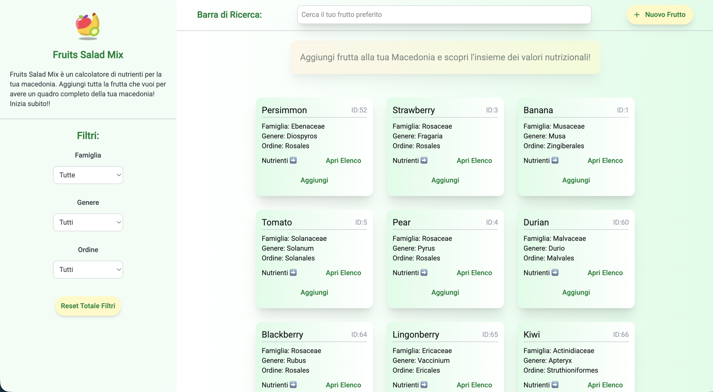
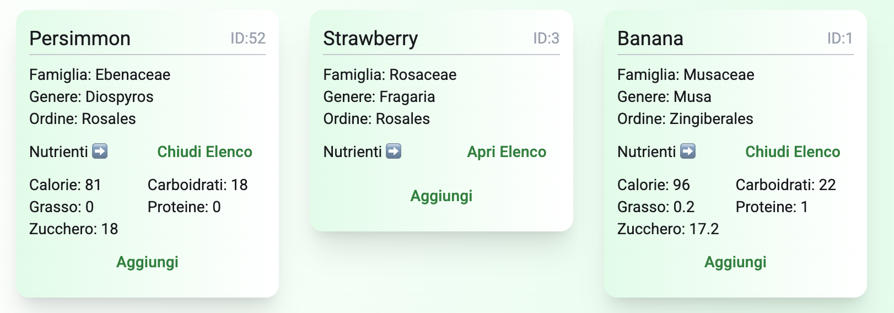
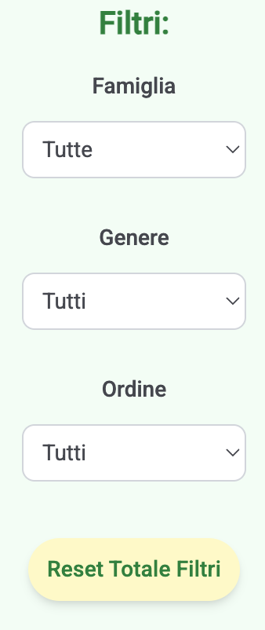
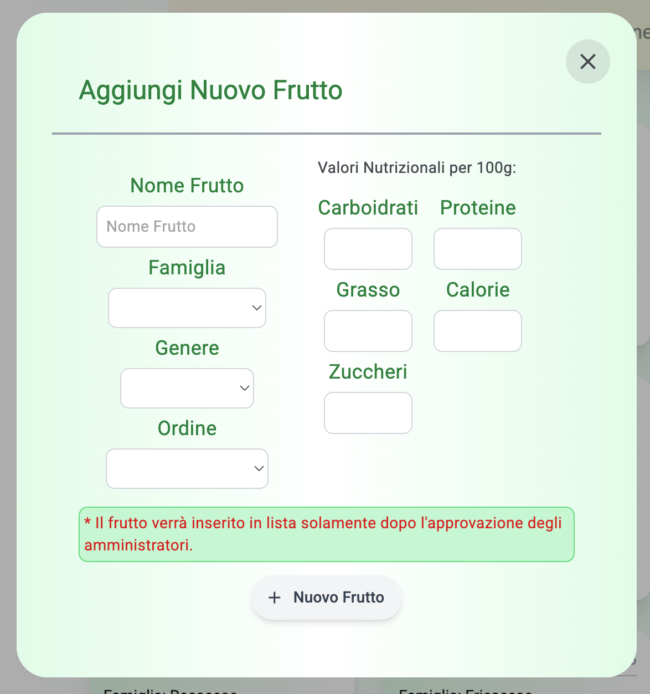
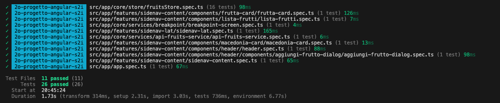

# 🍓 Fruits Salad Mix 🍊

## 🗂️ Indice

- [Descrizione](#-descrizione)
- [Demo Online](#-demo-online)
- [Screenshot Applicazione](#-screenshot-applicazione)
- [Funzionalità dell'applicazione](#-funzionalità-dellapplicazione)
- [Architettura dell'applicazione](#-architettura-dellapplicazione)
- [Backend API](#-backend-api)
- [Tecnologie e librerie utilizzate](#-tecnologie-e-librerie-utilizzate)
- [Prerequisiti](#-prerequisiti)
- [Installazione e Configurazione](#-installazione-e-configurazione)
- [Deployment](#-deployment)
- [Struttura Del Progetto](#-struttura-del-progetto)
- [Contatti](#-contatti)

---

## 📜 Descrizione

**Fruits Salad Mix** nasce dall'idea di creare un calcolatore per la propria macedonia, dove, tramite i valori nutrizionali di ogni frutto, possiamo capire quanto la nostra macedonia possa portare benefici o no al nostro corpo.
La Dashboard è stata sviluppata con Angular in modalità SPA (Single Page Application). Il progetto, poiché l'API pubblica FruityVice non consente richieste dirette dal browser a causa della politica CORS, utilizza un'architettura separata frontend / backend dove Angular comunica con un backend Express sviluppato interamente in locale che funge da BFF (Backend For Frontend).

L'applicazione permette agli utenti di:
- Visualizzare la lista di frutti disponibili;
- Visualizzare i valori nutrizionali di ogni frutto;
- Aggiungere il frutto desiderato alla macedonia;
- Visualizzare il contenuto della macedonia con il totale dei valori nutrizionali;
- Cancellare il frutto non desiderato dalla macedonia con conseguente aggiornamento dei valori nutrizionali;
- Aggiungere un nuovo frutto alla lista tramite dialog apposito con conseguente approvazione da parte degli amministratori del backend;
- Filtrare la lista frutti tramite Select dedicati nella sidenav laterale (Famiglia, Ordine e Genere);
- Ricercare il frutto tramite la barra di ricerca;
- Apertura e chiusura sidenav laterale in modalità Mobile

---

## 🌍 Demo Online

l'applicazione è disponibile Online al seguente indirizzo: [Fruits Salad Mix](https://fruits-salad-mix-1995.web.app)

[Backend](https://fruits-api-backend-l5jy.onrender.com/api/fruit)

---

## 📷 Screenshot Applicazione

### Schermata Principale


### Card frutta con valori nutrizionali


### Elenco filtri select


### Dialog Aggiungi Nuovo Frutto


### Macedonia completa di frutti e total valori nutrizionali


### Modalità Mobile Responsive


---

## 🛠️ Funzionalità dell'applicazione

### 1. Dashboard Principale

- **Lista Frutta**: La lista frutta viene caricata direttamente all'apertura dell'applicativo;
- **Frutta Card**: La Card singola di ogni frutto viene riempita da tutti i dati che arrivano dal backend come nome, ID, famiglia, genere e ordine. Troviamo anche una sezione dedicata ai valori nutrizionali che si apre e chiude con un bottone apposito. Con il bottone Aggiungi invece l'utente può aggiungere il seguente frutto alla macedonia;
- **Macedonia**: All'apertura dell'applicazione la sezione macedonia viene presentata semi-trasparente per poi colorarsi all'ingresso del 1o frutto. Ogni frutto inserito crea una chips che visualizza il nome e un'icona X per eliminare il frutto dalla macedonia. In automatico si crea una sezione valori nutrizionali con il totale di tutti i frutti presenti in essa;
- **Barra di Ricerca**: La barra di input posta in alto aiuta l'utente per la ricerca del frutto desiderato, di conseguenza la lista frutti verrà filtrata e aggiornata;
- **Filtri Select**: Nella sidenav Laterale si trovano i filtri select per famiglia, genere e ordine. Gli elenchi vengono creati dinamicamente dai dati presi dai frutti in arrivo dal backend senza ripetizioni;
- **Tasto Reset Filtri**: Il tasto reset riporta tutti i valori dei filtri al proprio stato iniziale;
- **Tasto + Nuovo Frutto**: Il tasto + Nuovo Frutto apre un dialog apposito dove compilare una serie di dati richiesti per l'inserimento di un nuovo frutto nella lista. Il frutto non verrà immediatamente visualizzato visto che deve essere prima approvato dagli amministratori dell'API pubblica FruityVice;

### 2. Dialog Aggiungi Frutto
- Il dialog si compone di un form, dove inserire tutti i dati richiesti dal backend, e del bottone Submit per l'invio dei dati e la richiesta di aggiunta del frutto.

---

## 🧱 Architettura dell'applicazione

Il frontend Angular non comunica direttamente con l'API Pubblica Fruityvice (CORS). <br>
Durante lo sviluppo Angular utilizza un proxy (proxy.conf.json) per aggirare le limitazioni CORS e dar la possibilità al browser di far visualizzare i dati.
Il proxy è disponibile esclusivamente in ambiente di sviluppo e non può essere utilizzato in produzione. Quindi ho optato per un backend Express che funge da Backend For Frontend (BFF)

Tutte le richieste passano attraverso il backend Express sviluppato appositamente, che gestisce:
- chiamate verso API esterne;
- configurazione delle variabili d'ambiente;
- gestione errori;
- controllo CORS;
- esposizione delle API utilizzate dal frontend.

Questa soluzione rende il frontend indipendente dal servizio esterno e permette una maggiore scalabilità futura.

Utente ➡️ Firebase Hosting ➡️ Angular SPA ↗️ HTTP ↘️ Express Backend (BFF) ➡️ FruityVice API

---

## 🔌 Backend API

### 1. Recupero Lista frutta

GET - /api/fruit

Restituisce la lista completa dei frutti disponibili

#### Status Code

200 OK

### 2. Recupero singolo frutto

GET - /api/fruit/:nome

Restituisce il singolo frutto ricercato tramite la barra di ricerca

#### Status Code

200 OK <br>
404 Not Found

### 3. Aggiunta nuovo frutto

PUT - /api/fruit

Riceve un nuovo oggetto frutto tramite body JSON e restituisce un messaggio di successo, inoltrato dall'API Fruityvice.

#### Status Code

200 OK <br>
422 Unprocessable Entity <br>
500 Internal Server Error

---

## ♻️ Tecnologie e librerie Utilizzate

### 1. Framework e Linguaggi

| Layer | Tecnologie |
|--------|------------|
| Frontend | Angular, TypeScript, Tailwind CSS, Angular Material |
| State Management | NgRx Signal Store |
| Backend | Node.js, Express, TypeScript |
| API Esterna | FruityVice |
| Hosting Frontend | Firebase Hosting |
| Hosting Backend | Render |
| Testing | Vitest |

#### 1.1 Frontend

| Tecnologia | Versione | Descrizione |
|------------|-----------|------------|
| **Angular** | 21.2.2 | Framework principale per lo sviluppo frontend |
| **TypeScript** | 5.9.3 | Linguaggio di programmazione con tipizzazione |
| **HTML 5** | - | Markup per la struttura delle pagine|
| **Tailwind** | 4.1.12 | Framework per lo stile |

#### 1.2 Backend

| Tecnologia | Versione | Descrizione |
|------------|-----------|------------|
| **Node.js** | 26.1.1 | Runtime Javascript lato server |
| **TypeScript** | 5.9.3 | Linguaggio di programmazione con tipizzazione |
| **Express** | 5.0.6 | Framework backend REST API |
| **dotenv** | 17.4.2 | Gestione variabili d'ambiente |
| **CORS** | 2.8.19 | Gestione richieste cross-origin |


### 2. Librerie UI e Component

| Libreria | Versione | Utilizzo nell'App |
|------------|-----------|------------|
| **@angular/material** | 21.2.14 | Componenti UI Material Design (cards, bottoni, dialog, ecc.) |
| **@angular/cdk** | 21.2.14 | Component Development Kit | 
| **@ngxpert/hot-toast** | 6.3.0 | Libreria di toast notification per Angular | 

### 3. Forms

| Libreria | Versione | Utilizzo nell'App |
|------------|-----------|------------|
| **@angular/forms** | 21.2.0 | Gestione dei form reattivi e validazione degli stessi|

### 4. HTTP e State Management

| Libreria | Versione | Utilizzo nell'App |
|------------|-----------|------------|
| **@angular/common/http** | 21.2.0 | HttpClient per le chiamate API |
| **@ngrx/signals** | 21.1.1 | SignalStore per una gestione dello stato moderna basata sui signals|
| **RxJS** | 7.8.0 | Programmazione reattiva per la gestione asincrona

### 5. Testing

| Libreria | Versione | Utilizzo nell'App |
|------------|-----------|------------|
| **Vitest** | 4.1.10 | Test runner e framework con sintassi compatibile Jest, usato per scrivere ed eseguire tutti i test dell'applicazione |

### 6. Build e Development

| Libreria | Versione | Utilizzo nell'App |
|------------|-----------|------------|
| **@angular/cli** | 21.2.0 | CLI per lo sviluppo |
| **@angular/build** | 21.2.2 | Sistema di Build |

---

## 🧩 Installazione e Configurazione

### 1. Clonare il Repository

```bash
# Clona il repository
git clone <url-del-repository>

# Entra nella Directory del progetto
cd progetto-new-fruits-salad
```
### 2. Istallare le dipendenze

#### 2.1 Frontend

```bash
# Entra nella directory del frontend
cd frontend

# Installa tutte le dipendenze npm
npm install
```

Questo comando installerà tutte le librerie elencate in `package.json` nella cartella `node_modules/`.

**Tempo stimato**: 2-5 minuti (dipende dalla velocità della connessione)

#### 2.2 Backend

Aprire un nuovo terminale

```bash
# Entra nella directory del backend
cd backend

# Installa tutte le dipendenze npm
npm install
```

### 3. Avviare l'Applicazione

Così facendo avremo due terminali, uno dedicato al frontend e uno dedicato al backend:

#### 3.1 Frontend

```bash
# Avvia il server di sviluppo
ng serve
```

L'applicazione sarà disponibile su: **http://localhost:4200/**

Il server si riavvierà automaticamente quando modifichi i file sorgente (Hot Reload).

#### 3.2 Backend

Creare un file `.env` nella cartella backend copiando il file `.env.example`.

```env
FRUITYVICE_URL=https://www.fruityvice.com/api/fruit
```

```bash
# Compila il progetto Typescript
npm run build

# Avvia il backend server Express
npm start
```

### 4. Testing Frontend

L'applicazione utilizza **Vitest** sia come linguaggio di scrittura dei test (sintassi `describe`, `it`, `expect`) sia come test runner.

```bash
# Esegue tutti i test una volta
npm run test

# Esegue in watch mode (ri-esegue al cambio file)
npm run test:watch

# Oppure
ng test
ng test --include #url singolo file da testare

# Test secco senza watch mode
ng test --watch=false
```

### Copertura attuale

- **11 file di test**
- **26 test totali**
- Componenti, servizi, store
- Tutte le funzionalità principali sono testate

Vitest è compatibile con Jest, ma molto più veloce grazie all'integrazione con Vite.



---

## 🚀 Deployment

### 1. Frontend

Il frontend Angular viene compilato in modalità produzione:

```bash
npm run build
```

e pubblicato tramite Firebase Hosting.

### 2. Backend

Il backend Express viene deployato tramite Render.

Le variabili ambiente vengono configurate direttamente sulla dashboard Render:

```env
FRUITYVICE_URL=https://www.fruityvice.com/api/fruit
```

---

## 📂 Struttura Progetto

```
├── .firebase
├── backend
│   ├── src
│   │   ├── config
│   │   ├── controllers
│   │   ├── middleware
│   │   ├── models
│   │   ├── routes
│   │   ├── services
│   │   ├── app.ts
│   │   └── index.ts
│   ├── .env.example
│   ├── package-lock.json
│   ├── package.json
│   └── tsconfig.json
├── frontend
│   ├── public
│   │   ├── screenshot
│   ├── src
│   │   ├── app
│   │   │   ├── core
│   │   │   │   ├── models
│   │   │   │   ├── services
│   │   │   │   │   ├── api-fruits-service
│   │   │   │   │   └── breakpoint
│   │   │   │   └── store
│   │   │   ├── features
│   │   │   │   ├── sidenav-content
│   │   │   │   │   ├── components
│   │   │   │   │      ├── frutta-card
│   │   │   │   │      ├── header
│   │   │   │   │      │   ├── components
│   │   │   │   │      │      └── aggiungi-frutto-dialog
│   │   │   │   │      ├── lista-frutti
│   │   │   │   │      └── macedonia-card
│   │   │   │   └── sidenav-lat
│   │   │   ├── app.config.ts
│   │   │   ├── app.css
│   │   │   ├── app.html
│   │   │   ├── app.routes.ts
│   │   │   ├── app.spec.ts
│   │   │   └── app.ts
│   │   ├── environments
│   │   ├── index.html
│   │   ├── main.ts
│   │   ├── material-theme.scss
│   │   └── styles.css
│   ├── .postcssrc.json
│   ├── angular.json
│   ├── package-lock.json
│   ├── package.json
│   ├── proxy.conf.json
│   ├── tsconfig.app.json
│   ├── tsconfig.json
│   └── tsconfig.spec.json
├── .editorconfig
├── .firebaserc
├── .gitignore
├── .prettierrc
├── README.md
├── firebase.json
└── package-lock.json
```

---

## 📩 Contatti

Christian Giaccardi - 📧 [chrigiaccardi@gmail.com](mailto:chrigiaccardi@gmail.com) <br>
GitHub - [chrigiaccardi](https://github.com/chrigiaccardi) <br>
LinkedIn - [LinkedIn](https://it.linkedin.com/in/christian-giaccardi-753085180?trk=public_profile_browsemap_profile-result-card_result-card_full-click)